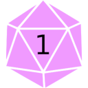

<p align="center">
  
</p>
<h1 align="center">Drow</h1>

Dungeons and dragons helper. You can use it at https://sergius02.github.io/drow/

Using https://www.dnd5eapi.co/ to get the data.

> Note:
> Project under development, some features can fail. Please if you find a problem, notify at https://github.com/sergius02/drow/issues

### Working

* Battle tracking
* Complete monster list
* Monster documentation window

### Not yet

* Class list
* Spell list
* Other list like conditions/equipment/...

### Install in local
```bash
# Clone this repository
git clone https://github.com/sergius02/drow

# cd into project
cd drow

# Install dependencies
npm install

# Execute it
ng serve
```
